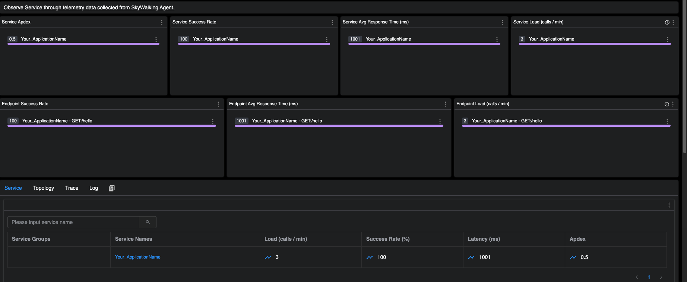
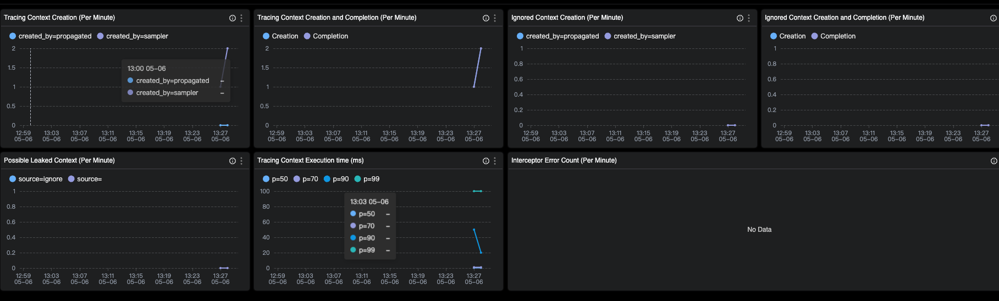
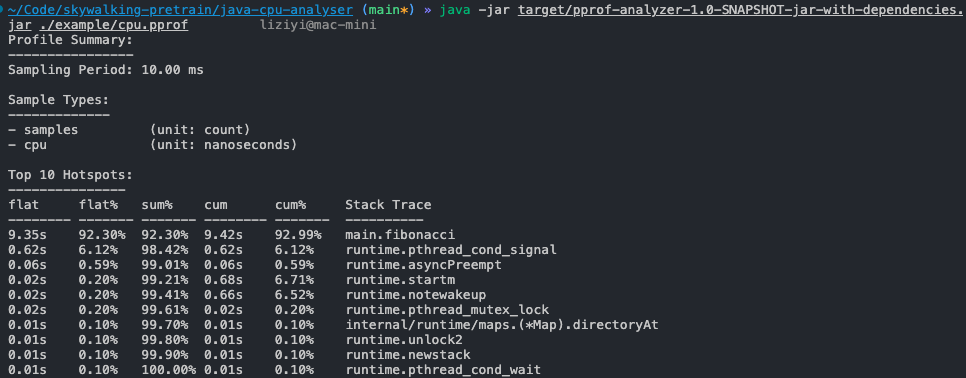

# OSPP 2025 Apache-skywalking-pretrain

This is the OSPP 2025 pretrain program for @lizzy-0323

## Task-1-go-http-with-skywalking

### Step

Build a http program in go with skywalking-go agent, and the result will be seen in skywalking ui.

```sh
cd go=http-with-skywalking
sh run.sh
```

And start a http GET query as follows

```sh
curl 127.0.0.1:8000/hello
```

### Result





## Task-2-java-cpu-analyser

### Step

1. Build a golang program to emulate high cpu usage scene
2. using pprof for cpu profiling, and save the profile to file
3. Build a java program to analyse the result

```sh
# Save profile 
go run main.go

# Analyse
mvn clean package
java -jar target/pprof-analyzer-1.0-SNAPSHOT-jar-with-dependencies.jar ./example/cpu.pprof
```

### Result

For emulation, I wrote a `fibonacci` function



For comparison, we can use `go tool pprof -text ./example/cpu.pprof`


We can see that there are some little differences here, the problem may be in the sort order or some runtime functions are ignored, for future research, maybe we need continue to view the pprof source code
